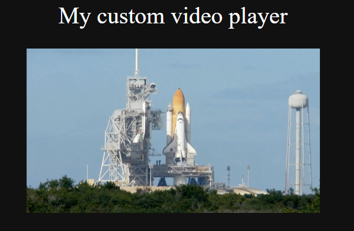
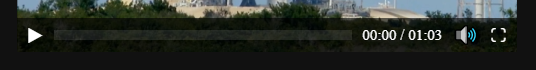
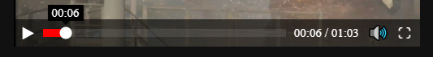
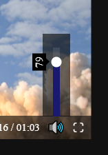
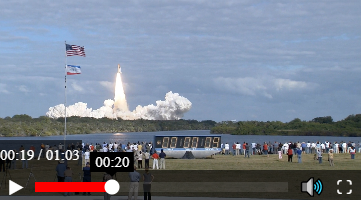

# Custom-video-player


HTML video tag has default controls that we can't change, fortunately the tag can be modified with javascript and we can add controls with html as well as use css styles.

This program was designed to manage multiple videos and it only needs the structure html to work. In addition, the user can control the video using the keyboard.
## Screenshots


The video player has basic controls with some style



It also has a current time indicator and a tooltip 



The volume control looks like this



When the width is lower than 400px looks like this



## HTML Structure

```html
    <div class="video">
        <video src=""></video>
        <div class="controls">
            <div class="play_pause" tabindex="0">&#9654</div>
            <div class="line" tabindex="0">
                <div class="circle"></div>
                <div class="counter">00:00</div>
            </div>
            <div class="time"><span class="current_time">00:00</span> / <span class="duration"></span></div>
            <div class="vol">
                <div class="btn_volume" tabindex="0">&#128266</div>
                <div class="content_volume">
                    <div class="volume line" tabindex="0">
                        <div class="circle"></div>
                        <div class="counter counter_s"></div>
                    </div>
                </div>
            </div>
            <div class="full_screen" tabindex="0">&#x26F6</div>
        </div>
    </div>
```

## LICENSE
[GPLv3.0](LICENSE)
